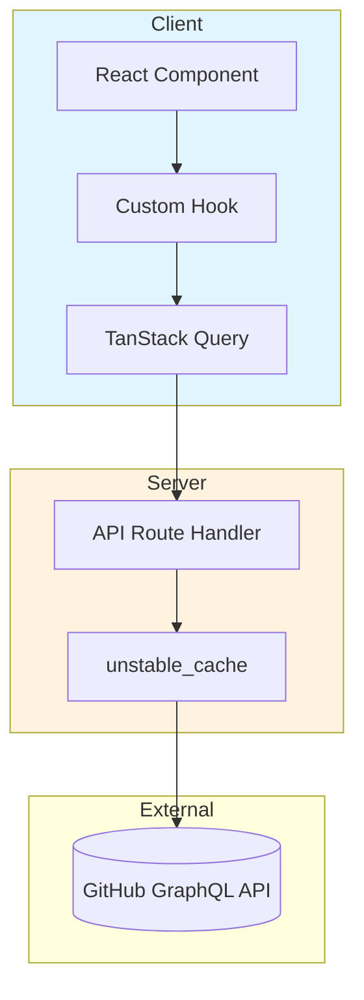
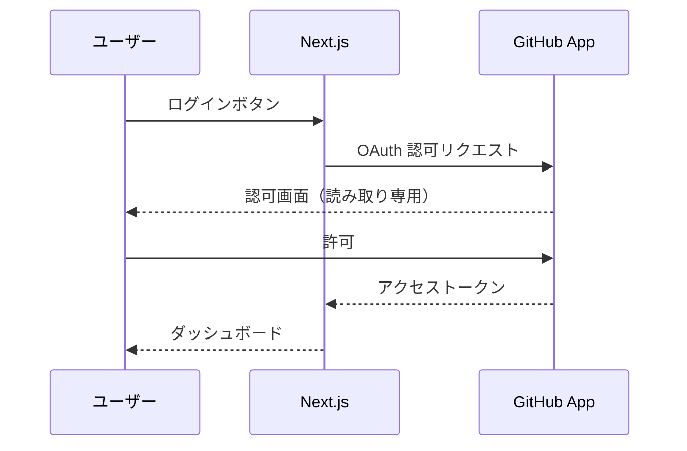

# GitHub Insights

[](https://nextjs.org/)
[](https://www.typescriptlang.org/)
[](LICENSE)

GitHub リポジトリ・ユーザーの貢献度を可視化する Web アプリケーション

**デモ**: [github-insights-orpin.vercel.app](https://github-insights-orpin.vercel.app)


---

## なぜ作ったか

GitHub の貢献データは **Contributions グラフ、リポジトリページ、プロフィールページ** に分散しており、「自分がどれだけ貢献したか」を伝えにくい状況でした。

特に以下のような場面で課題を感じていました：

| 場面 | 課題 |
|------|------|
| OSS 貢献のアピール | コミット数や順位が一目でわからない |
| モチベーション | 数値だけでは達成感が湧きにくい |
| ポートフォリオ | SNS で共有できる形式がない |

本アプリケーションは、GitHub GraphQL API からデータを集約し、**バッジによる達成感の演出** と **SNS 共有を意識した OG カード** を提供することで、OSS 貢献を可視化することを目指しています。

---

## 機能一覧

| 機能 | 説明 | ユーザー価値 |
|------|------|----------|
| バッジシステム | 貢献度に応じてバッジを自動付与 | 「Core Contributor」などの称号で達成感を演出 |
| OG カード生成 | SNS 共有用の画像を動的生成 | SNS で共有しやすいカード形式 |
| コントリビューターランキング | 貢献者を順位付け | 「あのリポジトリで 3 位」と言える |
| 言語統計 | リポジトリの言語構成を円グラフで表示 | プロジェクトの技術構成を一目で把握 |
| コミット推移 | 期間別コミット数を折れ線グラフで可視化 | 開発活動のトレンドを分析 |
| アクティビティヒートマップ | 曜日×時間帯の活動パターンを表示 | 作業スタイルの傾向を可視化 |

---

## OG カード

OSS 貢献を SNS でアピールするためのカードです。`@vercel/og` を使用して Edge Runtime で動的に生成します。


| エンドポイント | 用途 | シェア例 |
|---------------|------|--------|
| `/api/og/card/[owner]/[repo]/[user]` | リポジトリ貢献カード | 「Next.js に 50 コミットして 3 位になりました！」 |
| `/api/og/card/user/[user]` | ユーザープロファイルカード | 「私の GitHub 統計です」 |

バッジや順位がカードに表示されることで、共有のモチベーションにつながればと考えています。

---

## 技術スタック

| 役割 | 技術 | 選定理由 |
|------|------|----------|
| フレームワーク | Next.js 16 (App Router) | RSC + Route Handler でフルスタック開発 |
| 言語 | TypeScript | 型安全性による開発効率向上 |
| 認証 | NextAuth v5 + GitHub App | 読み取り専用権限で安全な GitHub 連携 |
| データ取得 | TanStack Query + Octokit GraphQL | キャッシュ管理の自動化 + 型安全な API クライアント |
| チャート | Recharts | React 向け、カスタマイズ性が高い |
| スタイル | Tailwind CSS v4 | ユーティリティファーストで高速開発 |
| テスト | Vitest + React Testing Library | Jest 互換で高速、React 公式推奨 |
| UI カタログ | Storybook | コンポーネント単体の開発・テスト |

---

## アーキテクチャ



---

## 認証フロー



### GitHub App 認証

本アプリケーションは **GitHub App** を使用して認証を行います。従来の OAuth App と比較して、以下の利点があります：

| 項目 | GitHub App | 旧 OAuth App |
|------|-----------|-------------|
| 権限 | `Contents: Read-only`（読み取り専用） | `repo`（読み取り+書き込み） |
| セキュリティ | ✅ 書き込み権限なし | ⚠️ 書き込み権限を含む |
| ユーザー信頼性 | ✅ 高い（明示的な読み取り専用） | ⚠️ 低い（権限範囲が広い） |
| レート制限 | 5,000+ リクエスト/時間 | 5,000 リクエスト/時間 |

**取得する権限:**
- `Contents: Read-only` - リポジトリのコード、コミット履歴の読み取り
- `Email addresses: Read-only` - ユーザーのメールアドレス取得
- `read:user` - ユーザープロファイル情報の読み取り

**リポジトリへの書き込みは一切行いません。** 安全に利用できます。

未認証ユーザーも Public リポジトリの分析が可能です。OSS リポジトリの分析に認証は本質的に不要なため、ログインなしでも試せるようにしています。ただし GitHub API のレート制限（60 リクエスト/時間）があるため、キャッシュ戦略で対応しています（詳細は [IMPLEMENTATION.md](docs/IMPLEMENTATION.md)）。

---

## クイックスタート

```bash
# 依存関係インストール
npm install

# 環境変数設定
cp .env.example .env.local

# 開発サーバー起動
npm run dev

# http://localhost:3001
```

### 環境変数

| 変数 | 説明 |
|------|------|
| `GITHUB_APP_CLIENT_ID` | GitHub App Client ID |
| `GITHUB_APP_CLIENT_SECRET` | GitHub App Client Secret |
| `GITHUB_APP_ID` | GitHub App ID |
| `NEXTAUTH_SECRET` | NextAuth 用シークレット（`openssl rand -base64 32` で生成） |
| `NEXTAUTH_URL` | アプリケーションURL（開発環境: `http://localhost:3001`） |

**GitHub App の作成方法は [docs/GITHUB_APP_MIGRATION.md](docs/GITHUB_APP_MIGRATION.md) を参照してください。**

---

## 開発コマンド

| コマンド | 説明 |
|----------|------|
| `npm run dev` | 開発サーバー起動 (port 3001) |
| `npm run build` | 本番ビルド |
| `npm run lint` | ESLint 実行 |
| `npm run test` | Vitest 実行 (watch モード) |
| `npm run test:run` | テスト実行 (単発) |
| `npm run test:coverage` | カバレッジ計測 |
| `npm run storybook` | Storybook 起動 |
| `npm run update-repos` | 人気リポジトリ JSON 更新 |

---

## プロジェクト構成

```
├── src/
│   ├── app/                    # App Router
│   │   ├── api/
│   │   │   ├── auth/           # NextAuth ハンドラー
│   │   │   ├── github/         # GitHub API プロキシ（キャッシュ付き）
│   │   │   └── og/card/        # OG 画像生成
│   │   ├── dashboard/          # 認証済みダッシュボード
│   │   ├── repo/[owner]/[repo]/ # リポジトリ詳細（未認証アクセス可）
│   │   └── user/[username]/    # ユーザープロファイル
│   ├── components/
│   │   └── charts/             # Recharts ラッパー（SSR 無効化）
│   ├── hooks/                  # TanStack Query ラッパー
│   └── lib/                    # GitHub API クライアント・ユーティリティ
├── public/data/                # 人気リポジトリ JSON
├── scripts/                    # 人気リポジトリ取得スクリプト
└── docs/                       # ドキュメント
```

---

## 詳細ドキュメント

📖 **[技術解説 (IMPLEMENTATION.md)](docs/IMPLEMENTATION.md)**

- キャッシュ戦略（サーバー/クライアント）
- 認証/未認証の分岐パターン
- レート制限対策
- OG 画像生成
- バッジシステム
- GitHub Actions による人気リポジトリ自動更新

📋 **[開発ロードマップ (ROADMAP.md)](docs/ROADMAP.md)**

---

## License

MIT
