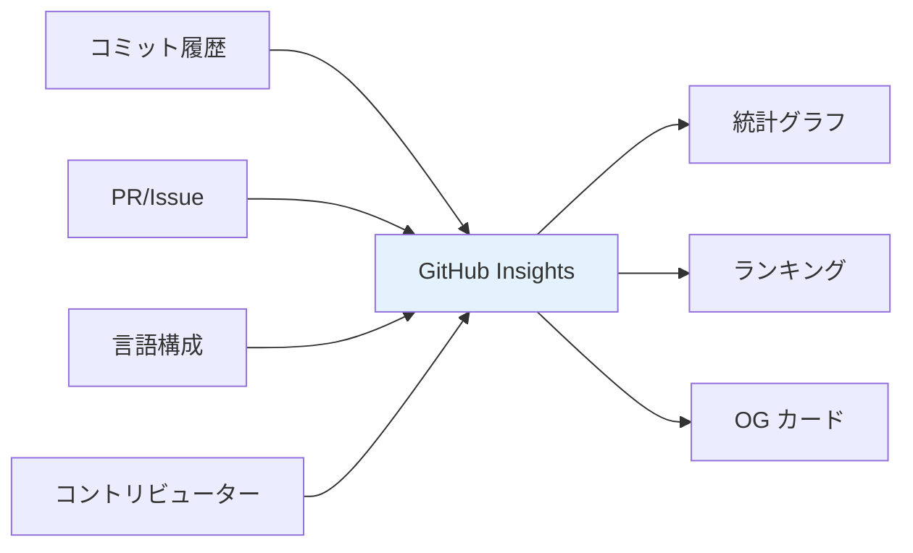
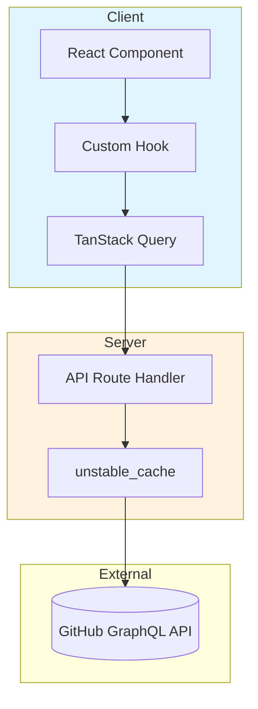
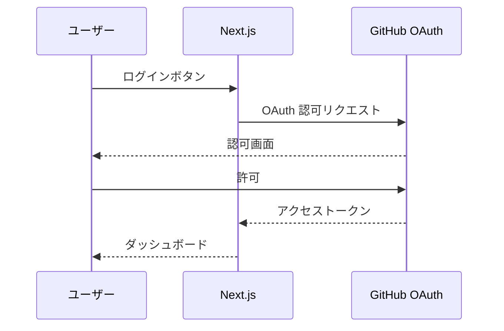

# GitHub Insights

[](https://nextjs.org/)
[](https://www.typescriptlang.org/)
[](LICENSE)

GitHub リポジトリ・ユーザーの貢献度を可視化する Web アプリケーション

---

## 解決する課題

GitHub の貢献データは分散しており、全体像の把握が難しい。



本アプリケーションは、これらのデータを集約し、以下を提供する:

| 機能 | 説明 |
|------|------|
| 言語統計 | リポジトリの言語構成を円グラフで表示 |
| コミット推移 | 期間別コミット数を折れ線グラフで可視化 |
| コントリビューターランキング | 貢献者を順位付けしてバッジを付与 |
| アクティビティヒートマップ | 曜日×時間帯の活動パターンを表示 |
| OG カード生成 | SNS 共有用の画像を `@vercel/og` で生成 |

---

## 技術スタック

| 役割 | 技術 |
|------|------|
| フレームワーク | Next.js 16 (App Router) |
| 言語 | TypeScript |
| 認証 | NextAuth v5 + GitHub OAuth |
| データ取得 | TanStack Query + Octokit GraphQL |
| チャート | Recharts |
| スタイル | Tailwind CSS v4 |
| テスト | Vitest + React Testing Library |
| UI カタログ | Storybook |

---

## アーキテクチャ



---

## 認証フロー



| スコープ | 説明 |
|---------|------|
| `read:user user:email` | Public リポジトリのみ |
| `read:user user:email repo` | Private リポジトリ含む |

未認証ユーザーも Public リポジトリの分析が可能（60 リクエスト/時間）。

---

## クイックスタート

```bash
# 依存関係インストール
npm install

# 環境変数設定
cp .env.example .env.local

# 開発サーバー起動
npm run dev

# http://localhost:3001
```

### 環境変数

| 変数 | 説明 |
|------|------|
| `GITHUB_ID` | GitHub OAuth App Client ID |
| `GITHUB_SECRET` | GitHub OAuth App Client Secret |
| `AUTH_SECRET` | NextAuth 用シークレット |

---

## 開発コマンド

| コマンド | 説明 |
|----------|------|
| `npm run dev` | 開発サーバー起動 (port 3001) |
| `npm run build` | 本番ビルド |
| `npm run lint` | ESLint 実行 |
| `npm run test` | Vitest 実行 (watch モード) |
| `npm run test:run` | テスト実行 (単発) |
| `npm run test:coverage` | カバレッジ計測 |
| `npm run storybook` | Storybook 起動 |
| `npm run update-repos` | 人気リポジトリ JSON 更新 |

---

## プロジェクト構成

```
├── src/
│   ├── app/                    # App Router
│   │   ├── api/
│   │   │   ├── auth/           # NextAuth ハンドラー
│   │   │   ├── github/         # GitHub API プロキシ（キャッシュ付き）
│   │   │   └── og/card/        # OG 画像生成
│   │   ├── dashboard/          # 認証済みダッシュボード
│   │   ├── repo/[owner]/[repo]/ # リポジトリ詳細（未認証アクセス可）
│   │   └── user/[username]/    # ユーザープロファイル
│   ├── components/
│   │   └── charts/             # Recharts ラッパー（SSR 無効化）
│   ├── hooks/                  # TanStack Query ラッパー
│   └── lib/                    # GitHub API クライアント・ユーティリティ
├── public/data/                # 人気リポジトリ JSON
├── scripts/                    # 人気リポジトリ取得スクリプト
└── docs/                       # ドキュメント
```

---

## 詳細ドキュメント

📖 **[技術解説 (IMPLEMENTATION.md)](docs/IMPLEMENTATION.md)**

- キャッシュ戦略（サーバー/クライアント）
- 認証/未認証の分岐パターン
- レート制限対策
- OG 画像生成
- バッジシステム
- GitHub Actions による人気リポジトリ自動更新

📋 **[開発ロードマップ (ROADMAP.md)](docs/ROADMAP.md)**

---

## License

MIT
