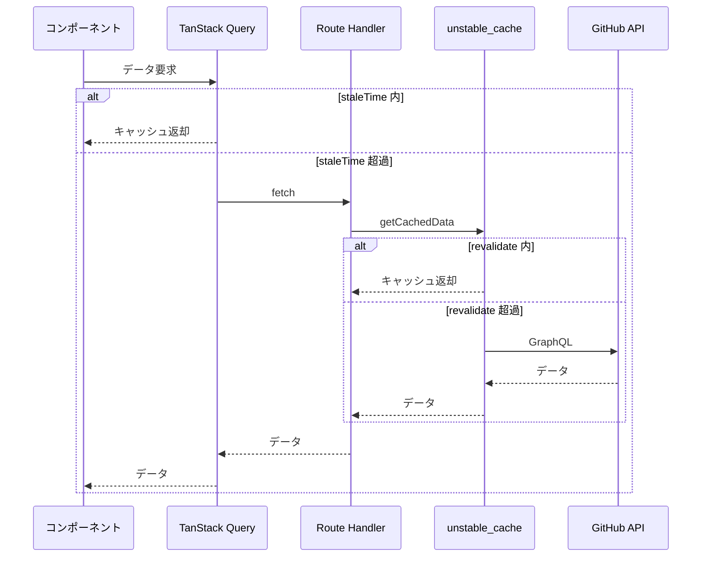
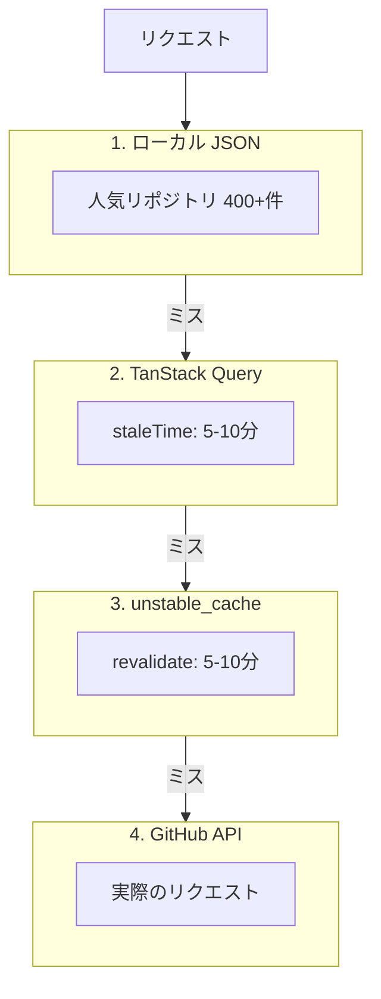

# GitHub Insights - 技術解説

---

## キャッシュ戦略

GitHub API のレート制限に対応するため、サーバー/クライアント両層でキャッシュを実装。

### キャッシュ設定の一元管理

```typescript
// src/lib/cache-config.ts

// サーバーサイドキャッシュ（秒単位）
export const SERVER_CACHE = {
  LANGUAGES_REVALIDATE: 600,     // 10分
  STATS_REVALIDATE: 600,
  COMMITS_REVALIDATE: 300,       // 5分
  CONTRIBUTORS_REVALIDATE: 300,
} as const;

// クライアントサイドキャッシュ（ミリ秒単位）
export const CLIENT_CACHE = {
  LANGUAGES_STALE_TIME: SERVER_CACHE.LANGUAGES_REVALIDATE * 1000,
  GC_TIME: 30 * 60 * 1000,       // 30分
} as const;
```

### 2層キャッシュの流れ



### サーバーサイド: Route Handler + unstable_cache

```typescript
// src/app/api/github/languages/route.ts

async function getCachedLanguageStats(accessToken: string | null, owner: string, repo: string) {
  const isAuthenticated = !!accessToken;
  const cacheKey = `languages:${owner}:${repo}:${isAuthenticated ? "auth" : "public"}`;
  
  const cachedFetch = unstable_cache(
    async () => getLanguageStats(accessToken, owner, repo),
    [cacheKey],
    {
      revalidate: SERVER_CACHE.LANGUAGES_REVALIDATE,
      tags: [`languages:${owner}:${repo}`],
    }
  );

  return cachedFetch();
}
```

### クライアントサイド: TanStack Query

```typescript
// src/hooks/useRepoData.ts

export function useLanguageStats({ owner, repo, enabled = true }: UseRepoDataParams) {
  return useQuery({
    queryKey: ["languageStats", owner, repo],
    queryFn: () => fetchLanguagesFromAPI(owner, repo),
    enabled: enabled && !!owner && !!repo,
    staleTime: CLIENT_CACHE.LANGUAGES_STALE_TIME,
  });
}
```

---

## 認証/未認証の分岐

アクセストークンの有無で処理を分岐。未認証でも Public リポジトリの分析が可能。

```typescript
// src/lib/github.ts

// 認証済みクライアント
export function createGitHubClient(accessToken: string) {
  return graphql.defaults({
    headers: { authorization: `token ${accessToken}` },
  });
}

// 未認証クライアント
export function createPublicGitHubClient() {
  return graphql.defaults({});
}
```

API 関数での分岐パターン:

```typescript
export async function getLanguageStats(
  accessToken: string | null,
  owner: string,
  repo: string
) {
  const client = accessToken
    ? createGitHubClient(accessToken)
    : createPublicGitHubClient();
  // ...
}
```

Route Handler でもキャッシュキーを分離:

```typescript
const cacheKey = `commits:${owner}:${repo}:${days ?? "all"}:${isAuthenticated ? "auth" : "public"}`;
```

---

## レート制限対策

| 認証状態 | 制限 |
|---------|------|
| 認証済み | 5,000 リクエスト/時間 |
| 未認証 | 60 リクエスト/時間 |

### 対策



### 人気リポジトリのローカル JSON

検索時に GitHub Search API を呼ぶ前に、ローカル JSON から即座に候補を表示。

```typescript
// src/hooks/useSearchRepositories.ts

async function searchLocalRepos(query: string): Promise<string[]> {
  const response = await fetch("/data/popular-repos.json");
  const data: PopularReposData = await response.json();
  
  return data.all
    .filter((repo) => repo.toLowerCase().includes(query.toLowerCase()))
    .slice(0, 10);
}
```

### GitHub Actions による自動更新

```yaml
# .github/workflows/update-popular-repos.yml

name: Update Popular Repos

on:
  schedule:
    - cron: "0 0 * * *"  # 毎日 UTC 0:00

jobs:
  update:
    runs-on: ubuntu-latest
    steps:
      - uses: actions/checkout@v4
      - uses: actions/setup-node@v4
      - run: npm ci
      - run: npx tsx scripts/fetch-popular-repos.ts
        env:
          GITHUB_TOKEN: ${{ secrets.GITHUB_TOKEN }}
      - uses: stefanzweifel/git-auto-commit-action@v5
        with:
          commit_message: "chore: update popular repos [skip ci]"
          file_pattern: "public/data/popular-repos.json"
```

---

## SSR 無効化

Recharts はサーバーサイドレンダリング非対応。`dynamic` インポートで対応。

```typescript
// src/app/dashboard/page.tsx

import dynamic from "next/dynamic";

const LanguagesPieChart = dynamic(
  () => import("@/components/charts/LanguagesPieChart"),
  { ssr: false }
);

const CommitsLineChart = dynamic(
  () => import("@/components/charts/CommitsLineChart"),
  { ssr: false }
);

const ActivityHeatmap = dynamic(
  () => import("@/components/charts/ActivityHeatmap"),
  { ssr: false }
);
```

---

## OG 画像生成

`@vercel/og` を使用して Edge Runtime で画像を生成。

```
src/app/api/og/card/
├── [owner]/[repo]/[user]/route.tsx  # リポジトリ貢献カード
└── user/[user]/route.tsx            # ユーザープロファイルカード
```

```typescript
// src/app/api/og/card/user/[user]/route.tsx

import { ImageResponse } from "@vercel/og";

export const runtime = "edge";

export async function GET(request: NextRequest, { params }: { params: { user: string } }) {
  const stats = await getUserStats(params.user);

  return new ImageResponse(
    (
      <div style={{ /* ... */ }}>
        
        <h1>{stats.name}</h1>
        <p>{stats.followers} followers</p>
      </div>
    ),
    { width: 1200, height: 630 }
  );
}
```

---

## バッジシステム

貢献度に応じてバッジを自動付与。

### コントリビューター用バッジ

```typescript
// src/lib/badges.ts

export function calculateBadges(
  contributor: ContributorDetailStat,
  totalContributors: number
): Badge[] {
  const badges: Badge[] = [];

  // コミット数ベース
  if (contributor.commits >= 100) badges.push(BADGES.core_contributor);
  else if (contributor.commits >= 50) badges.push(BADGES.dedicated_contributor);
  else if (contributor.commits >= 10) badges.push(BADGES.active_contributor);

  // 順位ベース
  if (contributor.rank === 1) badges.push(BADGES.top_contributor);
  else if (contributor.rank <= 3) badges.push(BADGES.top_3);

  // PR/レビューベース
  if (contributor.pullRequests >= 10) badges.push(BADGES.pr_master);
  if (contributor.reviews >= 10) badges.push(BADGES.reviewer);

  return badges;
}
```

### ユーザー用バッジ

```typescript
export function calculateUserBadges(stats: UserProfileStats): Badge[] {
  const badges: Badge[] = [];

  if (stats.followers >= 1000) badges.push(BADGES.influencer);
  else if (stats.followers >= 100) badges.push(BADGES.popular);

  if (stats.publicRepos >= 50) badges.push(BADGES.prolific);

  const createdYear = new Date(stats.createdAt).getFullYear();
  if (createdYear <= 2015) badges.push(BADGES.veteran);

  return badges;
}
```

### バッジ一覧

| バッジ | 条件 | カテゴリ |
|--------|------|---------|
| Top Contributor | 順位 1位 | コントリビューター |
| Core Contributor | 100+ コミット | コントリビューター |
| PR Master | 10+ PR | コントリビューター |
| Code Machine | 10,000+ 行追加 | コントリビューター |
| Influencer | 1,000+ フォロワー | ユーザー |
| Prolific | 50+ リポジトリ | ユーザー |
| Veteran | 2015年以前から利用 | ユーザー |

---

## コミット履歴のフィルタリング

認証状態に応じて取得期間を制御。

```typescript
// src/hooks/useCommitHistory.ts

function getBaseDays(requestedDays: number | null, isAuthenticated: boolean): number | null {
  // 未認証は30日まで
  if (!isAuthenticated) return 30;
  
  // 認証済みで90日以上リクエストなら365日分を取得
  if (requestedDays && requestedDays > 90) return 365;
  
  return 30;
}
```

クライアント側で表示用にフィルタリング:

```typescript
const filteredData = useMemo(() => {
  if (!query.data) return [];
  return filterCommitsByDays(query.data, days);
}, [query.data, days]);
```

---

## 検索機能

リポジトリ検索とユーザー検索を統合。`@` プレフィックスでユーザー検索に切り替え。

```typescript
// src/hooks/useSearchRepositories.ts

export function useSearchRepositories(query: string, options: Options) {
  const isUserSearch = query.startsWith("@");
  const searchQuery = isUserSearch ? query.slice(1) : query;
  const debouncedQuery = useDebounce(searchQuery, 300);

  // ローカル + リモート検索を組み合わせ
  const repoResults = useQuery({
    queryKey: ["searchRepos", debouncedQuery],
    queryFn: async () => {
      const [local, remote] = await Promise.all([
        searchLocalRepos(debouncedQuery),
        searchRemoteRepos(debouncedQuery),
      ]);
      return mergeResults(local, remote);
    },
    enabled: !isUserSearch && debouncedQuery.length >= 2,
  });

  const userResults = useQuery({
    queryKey: ["searchUsers", debouncedQuery],
    queryFn: () => searchRemoteUsers(debouncedQuery),
    enabled: isUserSearch && debouncedQuery.length >= 1,
  });

  return { results: repoResults.data, userResults: userResults.data, isUserSearch };
}
```

---

## テスト

Vitest + React Testing Library を使用。

### テスト対象

| 対象 | ファイル |
|------|---------|
| ユーティリティ | `src/lib/__tests__/api-utils.test.ts` |
| GitHub クライアント | `src/lib/__tests__/github.test.ts` |
| バッジ計算 | `src/lib/__tests__/badges.test.ts` |
| フック | `src/hooks/__tests__/*.test.ts` |
| コンポーネント | `src/components/__tests__/*.test.tsx` |

### 実行

```bash
# watch モード
npm run test

# 単発実行
npm run test:run

# カバレッジ
npm run test:coverage
```

---

## デプロイ

### Vercel

1. リポジトリを Vercel に接続
2. 環境変数を設定: `GITHUB_ID`, `GITHUB_SECRET`, `AUTH_SECRET`
3. GitHub OAuth App のコールバック URL を設定:
   ```
   https://your-domain.vercel.app/api/auth/callback/github
   ```

### 注意事項

| 項目 | 対応 |
|------|------|
| 画像ドメイン許可 | `next.config.ts` に `avatars.githubusercontent.com` を設定 |
| Recharts SSR | `dynamic` インポートで無効化 |
| プレビュー環境 | コールバック URL にワイルドカード設定が必要 |
