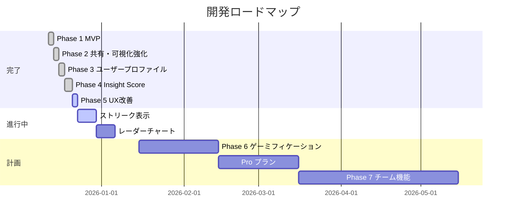

# GitHub Insights 開発ロードマップ

> 最終更新: 2025-12-22

## 概要

**目的**: 特定開発者のリポジトリへの貢献度を可視化する

**設計原則**（[VISION.md](./VISION.md) より）:
1. 達成感のデザイン - 数値をバッジ・スコアに変換
2. 共有体験のデザイン - 成果を発信しやすく
3. 洞察の可視化 - データから発見を得る
4. 信頼の基盤設計 - 最小権限で安全に

変更履歴は [CHANGELOG.md](../CHANGELOG.md) を参照。

---

## タイムライン

---

## 進捗サマリー

| Phase | 状態 | 主要機能 | 設計原則 |
|-------|------|----------|----------|
| 1. MVP | 完了 | 言語統計、コミット推移、ランキング、バッジ | 洞察、達成感 |
| 2. 共有強化 | 完了 | OGカード生成、レスポンシブ対応 | 共有体験 |
| 3. ユーザー機能 | 完了 | ユーザー検索、プロファイルページ、ヒートマップ | 洞察 |
| 4. Insight Score | 完了 | パーセンタイルスコア、GitHub Wrapped | 達成感、共有体験 |
| 5. UX改善 | 進行中 | テーマ切替、Xシェア、ストリーク | 共有体験 |
| 6. ゲーミフィケーション | 計画 | レア実績バッジ、リーダーボード | 達成感 |
| 7. チーム機能 | 計画 | 組織向け分析、API提供 | 洞察、信頼 |

---

## 差別化ポイント

### 類似サービスとの比較

| サービス | 特徴 | ターゲット |
|---------|------|-----------|
| github-readme-stats | 静的バッジ生成、無料 | 個人README装飾 |
| CodersRank | スキルスコア、ポートフォリオ | 求職者・採用担当 |
| GitClear / LinearB | チーム生産性分析 | エンジニアリングマネージャー |
| WakaTime | コーディング時間計測 | 個人の時間管理 |

### 本サービスの強み

| 強み | 設計原則 |
|------|----------|
| 日本語ファースト | - |
| SNS映えするOGカード | 共有体験 |
| 認証不要でPublic分析可能 | 信頼 |
| リポジトリ単位の貢献度可視化 | 洞察 |
| Insight Score & バッジ | 達成感 |

---

## 収益化モデル（計画）

### Freemium モデル

| 無料 | Pro（月額¥500〜1,000） |
|------|----------------------|
| Publicリポジトリ分析 | Privateリポジトリ対応 |
| 基本バッジ | レアバッジ・カスタムバッジ |
| 標準OGカード | カスタムテーマ |
| 直近30日分析 | 全期間分析 |

### チーム/組織向けプラン（月額¥3,000〜/チーム）

- 複数リポジトリ横断分析
- メンバー貢献レポート
- Slack/Discord 通知連携

---

## フェーズ詳細

### Phase 1: MVP（完了）

基本的な貢献度可視化機能。

- GitHub OAuth 認証
- 言語統計・コミット推移・コントリビューターランキング
- アクティビティヒートマップ
- バッジシステム（基本）
- 未認証でのPublicリポジトリ閲覧
- インクリメンタル検索

### Phase 2: 共有・可視化強化（完了）

- OGカード生成（@vercel/og）
- ダウンロード・URLコピー・Markdown生成
- バッジポップオーバー
- レスポンシブ対応

### Phase 3: ユーザープロファイル（完了）

- `@username` 形式でのユーザー検索
- ユーザープロファイルページ
- 統一レイアウト（AppHeader, DashboardLayout）
- ユーザー統計グラフ（言語、ヒートマップ、貢献タイプ）

### Phase 4: Insight Score & GitHub Wrapped（完了）

- Insight Score（パーセンタイル表示、ランク）
- GitHub Wrapped（年間統計、前年比較、専用バッジ）

### Phase 5: UX改善（進行中）

**設計原則**: 共有体験、洞察の可視化

完了:
- テーマ切り替え（next-themes）
- Xシェアボタン
- メタデータ最適化

未完了:
- ストリーク表示（連続コミット日数の可視化）
- レーダーチャート（複数指標のバランス表示）
- 生産性パターン（最も活発な時間帯・曜日）
- Pro機能（Stripe連携）

### Phase 6: ゲーミフィケーション拡張（計画）

**設計原則**: 達成感のデザイン

バッジ・実績:
- レア実績バッジ（Night Owl, Early Bird, Weekend Warrior, etc.）
- マイルストーン通知（「100コミット達成」などの節目を強調）
- レベルシステム（バッジより継続的な成長実感）
- 進捗プログレスバー（次のランクまでの距離を可視化）

リーダーボード:
- 期間別リーダーボード（週間/月間）
- 成長率分析（前月比・前年比）
- 週次/月次レポート（定期的な振り返り）

### Phase 7: チーム・組織向け機能（計画）

**設計原則**: 洞察の可視化、信頼の基盤設計

洞察の可視化:
- チームプラン（複数リポジトリ横断分析）
- コードレビュー統計（レビュー数、承認率、コメント傾向）
- Issue/PR対応速度（平均クローズ時間）
- コラボレーション分析（チームメンバー間の協力関係図）
- 技術トレンド（使用言語の時系列変化）

共有体験:
- ポートフォリオカード（複数リポジトリをまとめた1枚の紹介カード）
- READMEウィジェット（動的バッジをREADMEに埋め込み）
- Slack/Discord 連携（成果の自動投稿）

信頼の基盤設計:
- API提供（最小権限のアクセストークン設計）
- データエクスポート（JSON/CSVで自分のデータを持ち出し）
- プライバシーダッシュボード（取得データの透明性表示）

---

## 次のマイルストーン

### 短期（〜2025年3月）
- ストリーク表示（連続コミット日数）
- レーダーチャート（複数指標のバランス表示）
- 生産性パターン分析
- Pro機能（Stripe連携）

### 中期（〜2025年6月）
- レア実績バッジ & レベルシステム
- マイルストーン通知 & 進捗プログレスバー
- 週次/月次レポート
- 日本のテックコミュニティとの連携

### 長期（〜2025年12月）
- チーム分析（コードレビュー統計、コラボ分析）
- ポートフォリオカード & READMEウィジェット
- API提供 & データエクスポート
- 多言語対応
